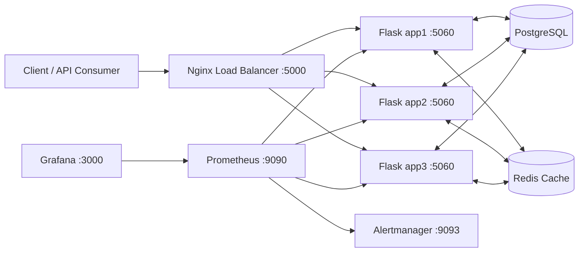

# URL shortener

This is our Groups MLH/Meta Production Engineering URL shortener project. It started as a basic Flask app, then added Docker, load testing, cache tests, observability, and Prometheus/Grafana.

## Quick start for development

This path runs one Flask app and one PostgreSQL database.

Install uv:

```bash
# macOS / Linux
curl -LsSf https://astral.sh/uv/install.sh | sh

# Windows PowerShell
powershell -ExecutionPolicy ByPass -c "irm https://astral.sh/uv/install.ps1 | iex"
```

Install dependencies:

```bash
uv sync --all-extras
```

Copy env file:

```bash
# macOS / Linux
cp .env.example .env

# Windows PowerShell
Copy-Item .env.example .env
```

Set these values in `.env`:

- `DATABASE_NAME=hackathon_db`
- `DATABASE_HOST=localhost`
- `DATABASE_PORT=5432`
- `DATABASE_USER=postgres`
- `DATABASE_PASSWORD=postgres`

Start local PostgreSQL:

```bash
docker run --rm --name test_postgres -e POSTGRES_DB=hackathon_db -e POSTGRES_USER=postgres -e POSTGRES_PASSWORD=postgres -p 5432:5432 -d postgres:15
```

Run the app:

```bash
uv run run.py
```

Check health:

```bash
curl http://127.0.0.1:5000/health
```

Expected response:

```json
{ "status": "ok" }
```

## Quick start for production (docker compose + load balancing)

This path runs Nginx + 3 Flask instances + PostgreSQL + Redis + monitoring.

Copy env file:

```bash
# macOS / Linux
cp .env.example .env

# Windows PowerShell
Copy-Item .env.example .env
```

Set at least:

- `DATABASE_NAME`
- `DATABASE_USER`
- `DATABASE_PASSWORD`
- `GRAFANA_ADMIN_USER`
- `GRAFANA_ADMIN_PASSWORD`

Bring up the stack:

```bash
docker compose -f docker-compose.production.yml up -d --build
```

Check status:

```bash
docker compose -f docker-compose.production.yml ps
```

Main endpoints:

- API: `http://localhost:5000`
- Grafana: `http://localhost:3000`
- Prometheus: `http://localhost:9090`
- Alertmanager: `http://localhost:9093`

Stop stack:

```bash
docker compose -f docker-compose.production.yml down -v
```

## API map

Core resource schema is in [openapi.yaml](openapi.yaml).

Observability routes `/metrics` and `/metrics/prometheus` are implemented in the app code.

| method | path                          | purpose                 |
| ------ | ----------------------------- | ----------------------- |
| GET    | `/health`                     | health check            |
| GET    | `/users`                      | list users              |
| POST   | `/users`                      | create user             |
| GET    | `/users/<id>`                 | get user                |
| PUT    | `/users/<id>`                 | update user             |
| DELETE | `/users/<id>`                 | delete user             |
| POST   | `/users/bulk`                 | import users CSV        |
| GET    | `/urls`                       | list urls               |
| POST   | `/urls`                       | create short url        |
| GET    | `/urls/<id>`                  | get url                 |
| PUT    | `/urls/<id>`                  | update url              |
| DELETE | `/urls/<id>`                  | delete url              |
| GET    | `/urls/<short_code>/redirect` | redirect via short code |
| GET    | `/r/<short_code>`             | resolve short code      |
| GET    | `/events`                     | list events             |
| POST   | `/events`                     | create event            |
| GET    | `/metrics`                    | json metrics            |
| GET    | `/metrics/prometheus`         | prometheus metrics      |

## Submission docs

Deploy and rollback: [docs/deploy-guide.md](docs/deploy-guide.md)

Troubleshooting: [docs/troubleshooting.md](docs/troubleshooting.md)

Configuration: [docs/configuration.md](docs/configuration.md)

Runbooks: [docs/runbooks.md](docs/runbooks.md)

Decision log: [docs/decision-log.md](docs/decision-log.md)

Capacity plan: [docs/capacity-plan.md](docs/capacity-plan.md)

## Architecture diagram


